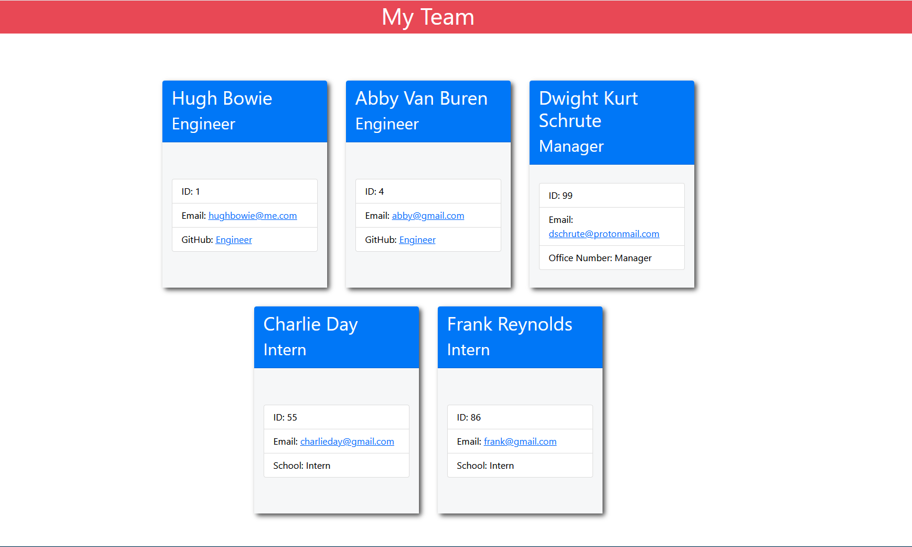

# Team Profile Generator

## Description
This app generates a webpage displaying your teams info, including their email addresses and GitHub profiles.

## Table of Contents 
* [Installation](#Installation)

* [Usage](#Usage)

* [License](#License)

* [Repository](#Repository)

* [Questions](#Questions)

## Installation
from command line: 
git clone https://github.com/hugh-bowie/teamProfileGenerator.git 
npm init 
npm install inquirer jest 

## Useage
from the command line: `node index.js`, input members of the team and the requested information.  Once complete a webpage will be generated.

## License:
This app is licensed under the MIT license.

## Walkthrough Video

[https://drive.google.com/file/d/159wMCEchxvI01Y83gOEdIYPD9bAd4-0v/view](https://drive.google.com/file/d/159wMCEchxvI01Y83gOEdIYPD9bAd4-0v/view)
